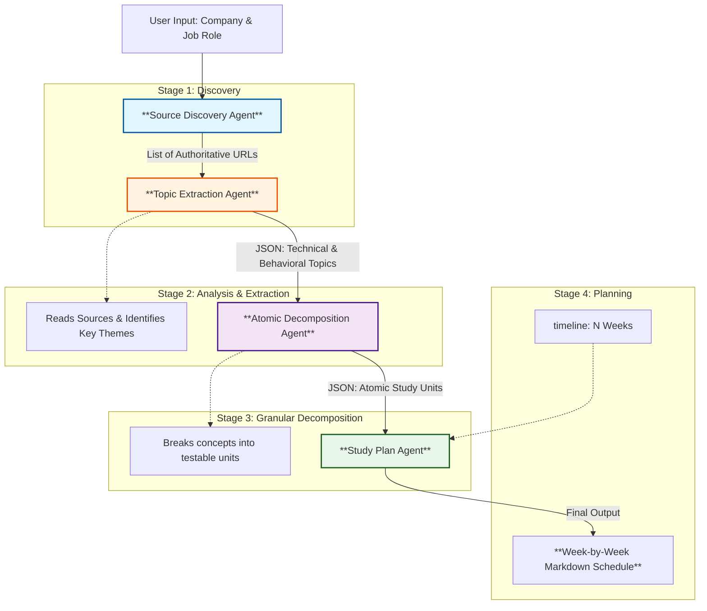

# Multi-Agent Research & Study Plan Generator

This workflow leverages a chain of specialized AI agents to autonomously research a target job role at a specific company and generate a comprehensive, actionable study plan.

## Workflow Architecture

The system follows a sequential pipeline where the output of one agent serves of the context for the next.



## Agent Breakdown

### 1. Source Discovery Agent
*   **Goal**: Identify trustworthy web entry points for research.
*   **Input**: `Company Name`, `Job Role`.
*   **Strategy**: Prioritizes official career pages, engineering blogs, and professional networks (LinkedIn, Glassdoor) over generic SEO content.
*   **Output**: A Python list of URLs.

### 2. Research & Topic Extraction Agent
*   **Goal**: Simulate "reading" the sources to identify high-level competency requirements.
*   **Input**: List of URLs from Agent 1.
*   **Logic**:
    *   Classifies findings into **Technical** (Hard skills, functional competencies, domain knowledge) and **Behavioral** (Culture, leadership principles).
    *   Ensures topics are grounded in the actual source text.
*   **Output**: Structured JSON containing high-level topics with importance scores and justifications.

### 3. Atomic Decomposition Agent
*   **Goal**: Turn high-level concepts into study-able units.
*   **Input**: High-level topics JSON.
*   **Logic**:
    *   Explodes broad terms (e.g., "System Design", "Sales Strategy") into granular sub-concepts (e.g., "Load Balancing", "Pipeline Management").
    *   Ensures coverage from beginner to advanced levels.
*   **Output**: JSON list of "Atomic Units".

### 4. Study Plan Scheduler Agent
*   **Goal**: Create a human-friendly execution plan.
*   **Input**: All Atomic Units + `Weeks` timeline.
*   **Logic**:
    *   Distributes topics logically over the timeline.
    *   Balances Technical and Behavioral work each week.
    *   Progresses from Foundations → Advanced → Mock Interview Prep.
*   **Output**: A formatted Markdown Study Schedule.

## How to Run

1.  Open `ResearchBasedAgent.ipynb`.
2.  Set your target in the setup cell:
    ```python
    company_name = "Amazon"
    job_role = "Sales Executive" # or "Software Engineer", etc.
    ```
3.  Run all cells sequentially.
4.  The final cell will print the complete study plan.
