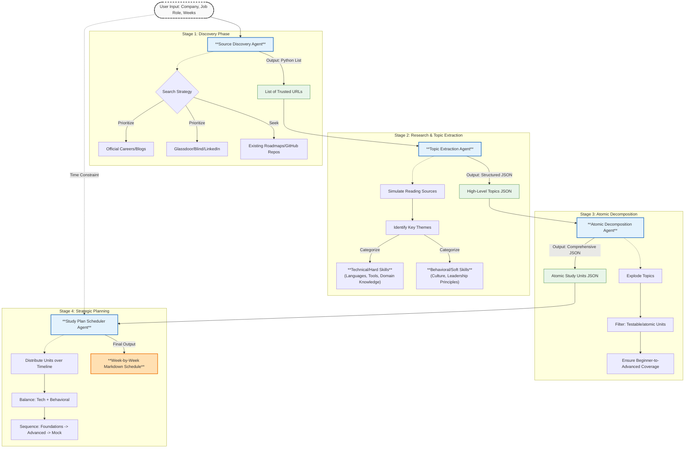

# Multi-Agent Research & Study Plan Generator

This workflow leverages a chain of specialized AI agents to autonomously research a target job role at a specific company and generate a comprehensive, actionable study plan.

## Workflow Architecture

The system follows a sequential pipeline where data flows from broad research to granular atomic units, finally synthesized into a temporal schedule.

## Agent Breakdown

### 1. Source Discovery Agent
*   **Goal**: Identify trustworthy web entry points and existing community roadmaps.
*   **Context**: `Company Name`, `Job Role`.
*   **Updated Logic**: Now explicitly searches for *existing study plans* or roadmaps on GitHub, Medium, or Reddit to leverage community knowledge.
*   **Output**: List of URLs (Python List).

### 2. Research & Topic Extraction Agent
*   **Goal**: Synthesize raw source data into competency buckets.
*   **Context**: List of URLs.
*   **Logic**:
    *   **Technical**: Defines this broadly as "Hard Skills & Domain Knowledge" (e.g., Coding for Eng, Sales Strategy for Sales).
    *   **Behavioral**: Focuses on Company Values (e.g., Amazon LPs) and cultural fit.
*   **Output**: JSON separating `technical_topics` and `behavioral_topics`.

### 3. Atomic Decomposition Agent
*   **Goal**: Break high-level concepts into study-able, testable units.
*   **Context**: High-level JSON.
*   **Logic**:
    *   Explodes broad terms (e.g., "System Design") into specific components (e.g., "Load Balancing", "Sharding").
    *   Ensures an exhaustive list covering beginner to advanced sub-topics.
*   **Output**: JSON list of `atomic_study_plan`.

### 4. Study Plan Scheduler Agent
*   **Goal**: Create a strategic timeline for preparation.
*   **Context**: Atomic Units + `Weeks` input.
*   **Logic**:
    *   **Progression**: Foundations → Core Concepts → Advanced → Mock/Synthesis.
    *   **Balance**: Mixes hard and soft skills weekly.
    *   **Exhaustion**: Ensures **ALL** atomic units are mapped to the schedule (no skipping).
*   **Output**: Formatted Markdown Schedule.
