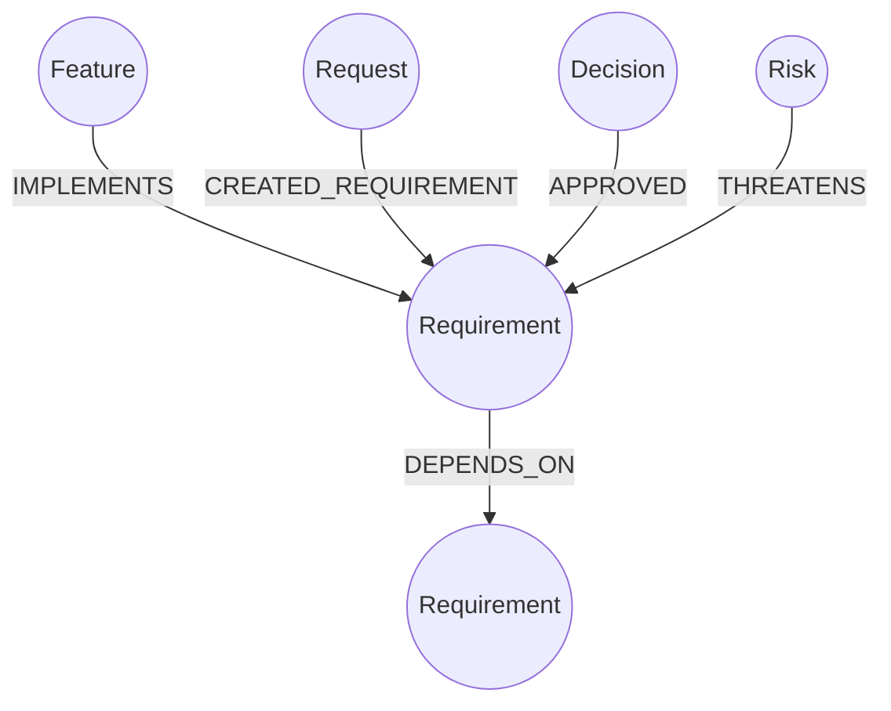
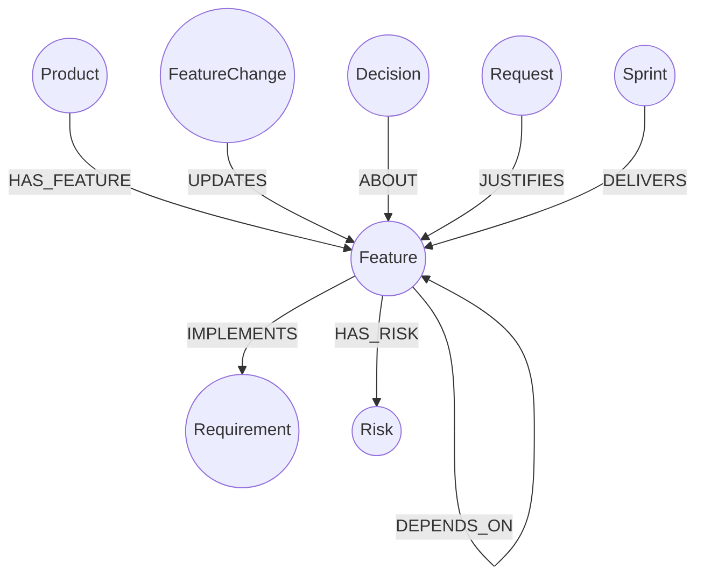
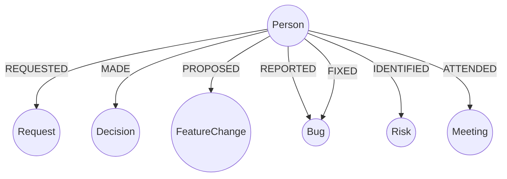
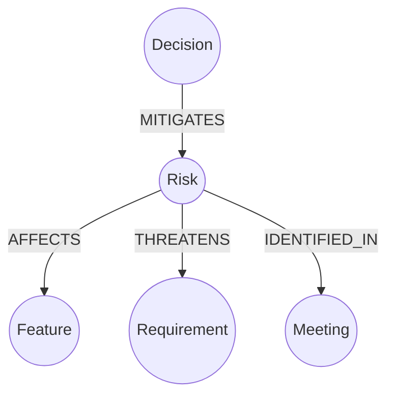
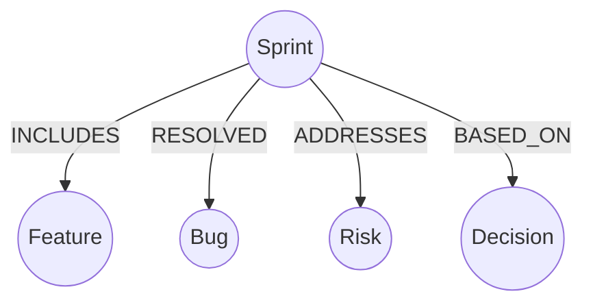
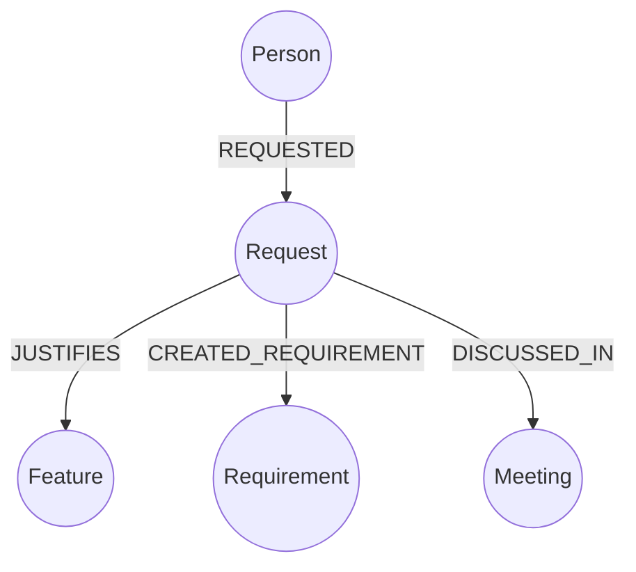
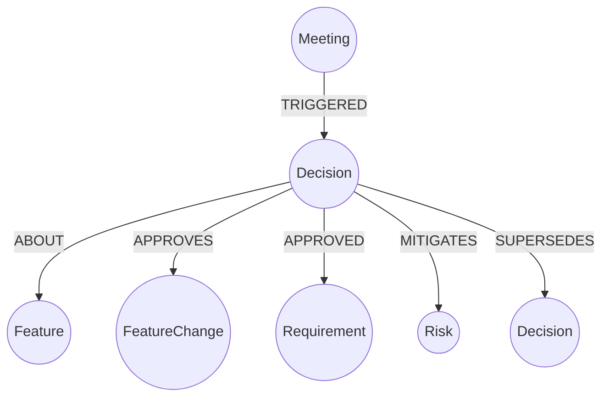
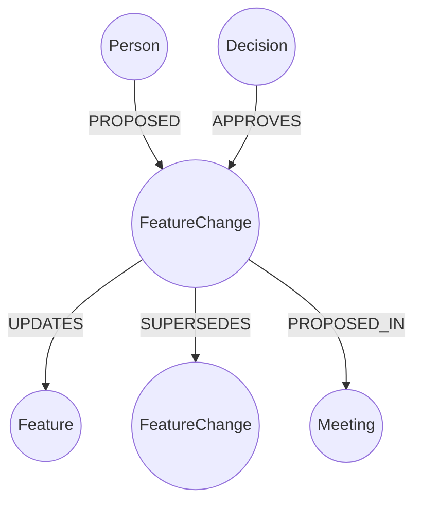
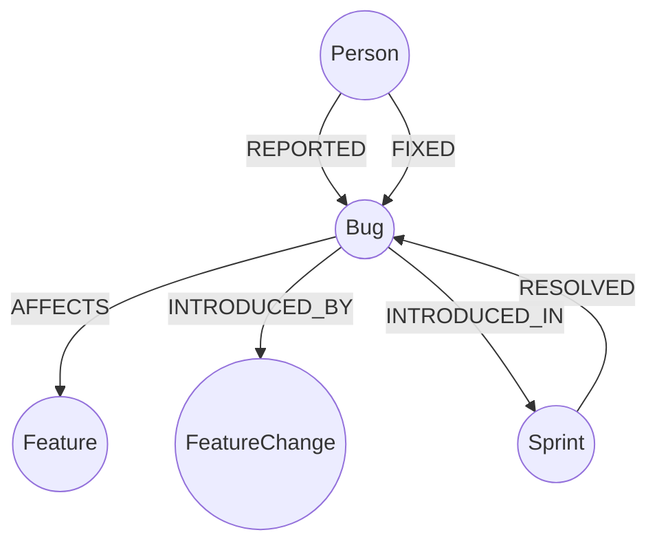
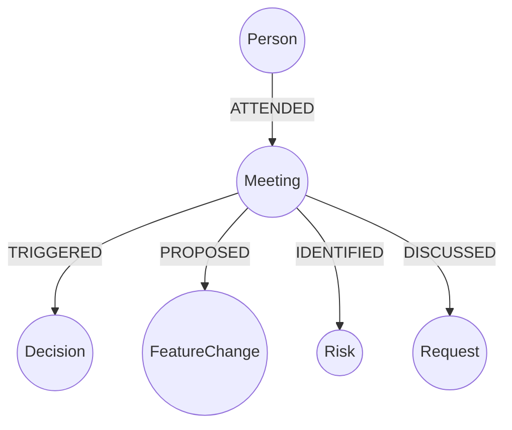

# Product Knowledge Graph: Entity & Relationship Design

## Entities
- **Feature**
- **Requirement**
- **Person**
- **Sprint**
- **Request**
- **Decision**
- **FeatureChange**
- **Risk**
- **Bug**
- **Meeting**

---

## 🧠 Entity → Relationship Map

### 1️⃣ Requirement
**Purpose:** What must be built, and how it depends on other requirements.

---

### 2️⃣ Feature
**Purpose:** Core product capability with full traceability.

---

### 3️⃣ Person
**Purpose:** Accountability and ownership.

---

### 4️⃣ Risk
**Purpose:** Capture uncertainty and threats.

---

### 5️⃣ Sprint
**Purpose:** Time-boxed execution.

---

### 6️⃣ Request
**Purpose:** Why something was needed.

---

### 7️⃣ Decision
**Purpose:** Authority and governance.

---

### 8️⃣ FeatureChange
**Purpose:** Track evolution without overwriting history.

---

### 9️⃣ Bug / Issue
**Purpose:** Stability and quality tracking.

---

### 🔟 Meeting
**Purpose:** Source of truth for discussions and transcripts.

---

## 🧩 Summary View (Mental Model)

| Entity        | Core Purpose     |
| ------------- | ---------------- |
| Requirement   | What must exist  |
| Feature       | What users get   |
| Request       | Why it exists    |
| Decision      | Authority        |
| FeatureChange | Evolution        |
| Bug           | Quality issues   |
| Risk          | Uncertainty      |
| Sprint        | Time execution   |
| Meeting       | Source of change |
| Person        | Accountability   |

---

## ⚠️ Design Rules (Important)

1. **Never overwrite Feature fields** for changes → Always add FeatureChange
2. **Never connect Meeting directly to Feature** → Always go through Decision / FeatureChange
3. **Every Bug should affect something** → No orphan bugs
4. **Every Decision must have a source** → Meeting or Document

---

## 🚀 What This Enables

You can now answer:
- Why does this feature exist?
- Who asked for it?
- Who approved changes?
- What broke after which change?
- Which sprint fixed it?
- Which meeting caused it?
