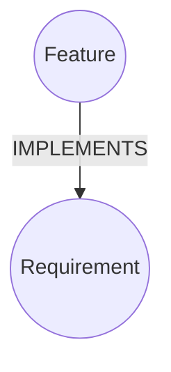
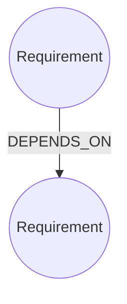
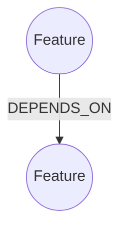
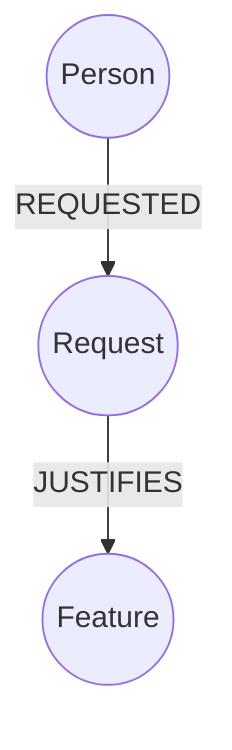
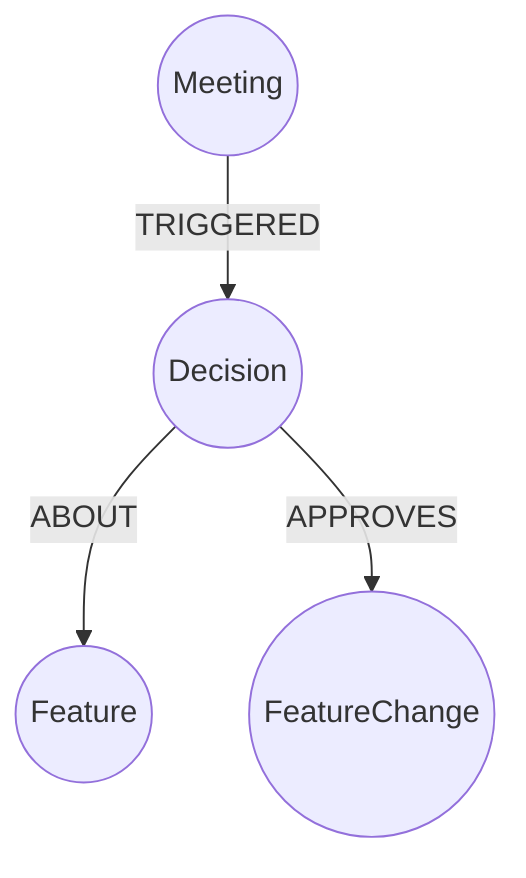
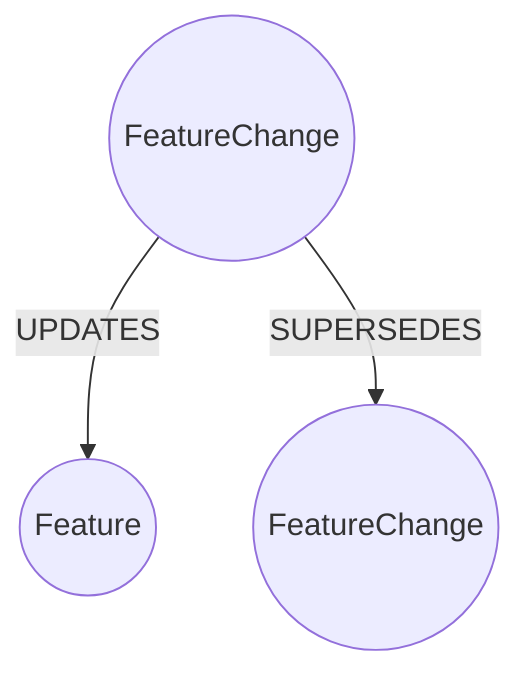
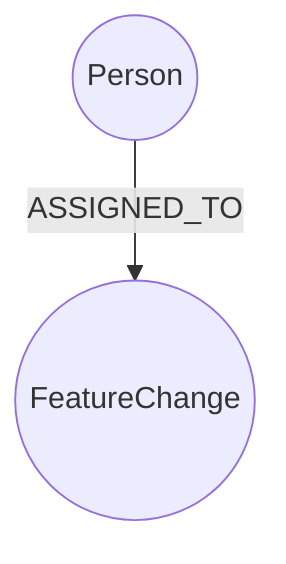
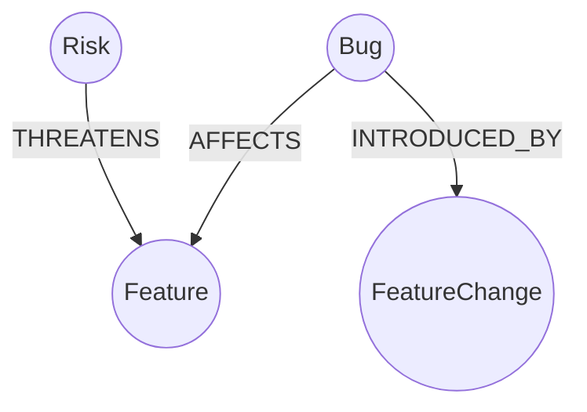

# Relationship Design Principles for Product Knowledge Graph

## Relationships Represent Meaning, Not Just Links


## Categories of Relationships

| Category       | Purpose                |
| -------------- | ---------------------- |
| Structural     | How product is built   |
| Ownership      | Who is responsible     |
| Causal         | Why something exists   |
| Governance     | Who approved what      |
| Temporal       | What changed over time |
| Quality / Risk | What can go wrong      |

---

## Structural Relationships

### Feature ↔ Requirement


### Requirement Dependencies


### Feature Dependencies


---

## Causal Relationships (WHY something exists)



---

## Governance Relationships (Authority Layer)



---

## Temporal Relationships (Evolution Layer)



---

## Ownership Relationships



---

## Quality Relationships (Bug & Risk)



---

## Should Relationships Have Properties?

Sometimes yes. Example:
```mermaid
graph TD
  Person((Person))
  Meeting((Meeting))
  Person -- ATTENDED{role: "Presenter", duration: 30} --> Meeting
```
If logic gets complex, use a node instead of a property-heavy relationship.

---

## Cardinality Rules

- A Feature can implement many Requirements.
- A Requirement can be implemented by many Features.
- A Decision can approve multiple FeatureChanges.
- A FeatureChange must update exactly one Feature.

---

## Naming Rules for Relationships

- Use ALL_CAPS
- Use verb phrases
- Use singular form

Good examples:
- IMPLEMENTS
- DEPENDS_ON
- APPROVES
- AFFECTS
- MITIGATES

Avoid:
- HAS
- RELATED_TO
- LINKED_WITH

---

## Avoid Relationship Explosion

Instead of many edge variations, use node properties:
```mermaid
graph TD
  Person((Person {role:"Client"}))
  Request((Request))
  Person -- REQUESTED --> Request
```

---

## Relationship Anti-Patterns

- ❌ Direct Meeting → Feature edits
- ❌ Direct Person → Feature state change
- ❌ Storing "why" as feature property
- ❌ Multiple meanings in one edge

Bad example:
```
Feature -[:UPDATED_AND_APPROVED_BY]-> Person
```

---

## The Golden Relationship Rule

For each relationship, ask:
1. Is this structural?
2. Is this causal?
3. Is this governance?
4. Is this temporal?
5. Is this quality-related?

If not, reconsider its existence.

---

## Big Design Question

What is your graph for?
- Operational tracking system
- Audit & traceability system
- AI reasoning engine
- All three

Relationship strictness depends on your answer.

---
